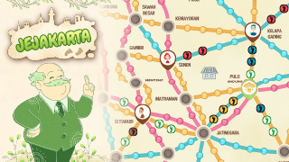

# My-Portofolio
Welcome to my land of codes and logics.

# Projects
If you are wondering what projects that I have been participated on, here is the list of them:
<h2>1. Jejakarta</h2>

<b>Google Play Store Link</b>: [Jejakarta](https://play.google.com/store/apps/details?id=com.hit.jejakarta&pcampaignid=web_share)

<b>Description</b>:

Jejakarta is an offline mobile board game published on Google Play Store (Android) by Polytron. It is a game about maintaining emissions in Jakarta through certain transportations such as electric bike, eco car, and train.

<b>My Role in this Project</b>: Full Game Programmer.

<h2>2. Rocket Escape</h2>

<b>Description</b>:

<b>My Role in this Project</b>: Game Designer.

<h2>3. Math Dungeon</h2>

Description:
