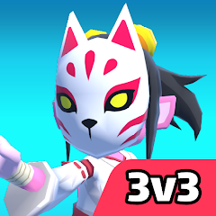

# My Portofolio
Welcome to my land of codes and logics.

# Projects
If you are wondering what projects that I have been participated on, here is the list of them:
<h2>COMPANY PROJECTS</h2>
<h3>1. Jejakarta</h3>

<b>Google Play Store Link</b>: [Jejakarta](https://play.google.com/store/apps/details?id=com.hit.jejakarta&pcampaignid=web_share)

<b>Description</b>:

Jejakarta is an offline mobile board game published on Google Play Store (Android) by Polytron. It is a game about maintaining emissions in Jakarta through certain transportations such as electric bike, eco car, and train.

<b>My Role in this Project</b>: Full Game Programmer.

<h3>2. Rocket Escape</h3>

<b>Google Play Store Link</b>: [Rocket Escape](https://play.google.com/store/apps/details?id=com.hit.rocketescape&pcampaignid=web_share)

<b>Description</b>:

Rocket Escape is a mobile hypercasual game published on Google Play Store (Android) by Polytron. It is a game about a cute little alien being identified as a threat by other races, which forcing him to survive by destroying their auto-military turrets.

<b>My Role in this Project</b>: Game Designer and Game Programmer.

<h3>3. Monkeyland Battleground</h3>

<b>Google Play Store Link</b>: [Monkeyland Battleground](https://play.google.com/store/apps/details?id=com.hit.monkeylandbattleground&pcampaignid=web_share)

<b>Description</b>:

Monkeyland Battleground is a mobile multiplayer game published on Google Play Store (Android) by Polytron. It is a game about monkeys that are fighting to build a gigantic mecha in order to win while preventing others for doing so.

<b>My Role in this Project</b>: Quality Assurance Programmer.

<h3>4. Power Kart Racing</h3>

<b>Google Play Store Link</b>: [Power Kart Racing](https://play.google.com/store/apps/details?id=com.hit.powerkartracing&pcampaignid=web_share)

<b>Description</b>:

Power Kart Racing is a multiplayer racing game published on Google Play Store (Android TV) by Polytron. It is an arcade racing game which players will compete for the best time of each map.

<b>My Role in this Project</b>: Lead Game Programmer.

<h2>PERSONAL PROJECTS</h2>

<h3>1. M Dungeon</h3>

<b>Game Link</b>: [M Dungeon](https://simpleai.itch.io/mdungeon)

<b>Description</b>:

M Dungeon is a web game published in itch.io, which is a simple quiz game about addition in mathematics where you must answer questions to earn points/score. This project was made for class assignment while studying in BINUS University (2020).

<b>My Role in this Project</b>: Game Designer, Game Programmer, Sound Engineer.

<h3>2. Autumn Harvest</h3>

<b>Game Link</b>: [Autumn Harvest](https://namecdream.itch.io/autumn-harvest)

<b>Description</b>:

Autumn Harvest is a web game made for Great Harvest Game Jam 2020 in itch.io. It is a simple game about buying seed, planting, and harvesting crops in order to earn more money.

<b>My Role in this Project</b>: All (Indie Developer).
